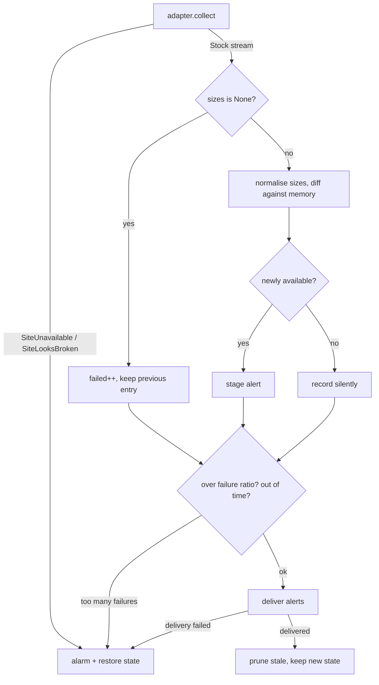

# Architecture

Zaiko is an engine plus one adapter per brand. The engine owns everything that
is the same for every shop; an adapter owns everything that is specific to one.

```
run.py                  CLI: --site, --dry-run, --seed, --list
  └── zaiko/runner.py   the engine — the only place alerts and state are decided
        ├── http.py     fetching, retries, encoding
        ├── notify.py   Pushover delivery, message chunking
        ├── state.py    load/save/prune the memory
        └── sites/
              base.py         the SiteAdapter contract
              shopify.py      shared reader for Shopify collection feeds
              comoli.py       COMOLI      — scrapes HTML
              graphpaper.py   Graphpaper  — Shopify feed
              neighbour.py    COMOLI at Neighbour — Shopify feed
```

## The one invariant

**Silence means "nothing new in your size". It must never mean "something broke
quietly."**

Everything below is downstream of that sentence. When a change is proposed, the
question to ask is whether it can produce silence in a case that isn't genuinely
"nothing new".

The corollary that most of the code implements: **a run only updates its memory
if it went well.** An unhealthy run restores the state it started with, so
anything it couldn't be sure about is re-derived next run rather than recorded
as already seen.

## The three-valued answer

Every product resolves to one of three things, and conflating the last two is
the bug this project keeps almost making:

| `Stock.sizes` | means | engine does |
|---|---|---|
| `["2", "4"]` | read it, these are in stock | compare to memory, maybe alert |
| `[]` | read it, nothing in stock | record as sold out |
| `None` | **could not read it** | keep previous state, count as failed |

`[]` is a claim. `None` is an admission. An adapter that returns `[]` when it
should return `None` produces a fake restock alert on the day the site
recovers — and worse, can silence a brand permanently if the wrong answer is
"no sizes match".

When in doubt, return `None`. A false "couldn't read" costs a day; a false
"sold out" corrupts the memory.

## Control flow of one site



## State

`state.json`, committed back to the repo by the workflow, keyed site → product
URL:

```json
{
  "comoli": {
    "https://www.comoli.jp/mailorder/jacket": {
      "name": "REVERSIBLE JACKET COLOR BLACK",
      "sizes": ["2", "4"],
      "changed_at": "2026-08-26T16:25:17+00:00",
      "last_seen": "2026-08-26T16:25:17+00:00"
    }
  }
}
```

Two rules keep the git history meaningful, and both have been broken once:

- `changed_at` is stamped **only when `sizes` actually changes**, never as a
  heartbeat.
- `last_seen` refreshes **only once it is more than `LAST_SEEN_REFRESH_DAYS`
  old**. Stamping it every run gave a ~260-line diff daily with no stock having
  moved, which buries the real changes.

**Before adding any field to a state entry, ask what it does to the diff of an
unchanged run.** The answer must be "nothing". There is a test for this
(`an unchanged run leaves the state file byte-identical`) — and note it only
works because the test advances a fake clock; written naively it passes for the
wrong reason, since two back-to-back runs land in the same second.

Products unseen for `STATE_TTL_DAYS` are forgotten, so the file doesn't grow
forever and a re-listed product counts as new rather than being compared with
year-old data.

## Where the safety lives

Deliberately in the engine, not the adapters — an adapter is the thing most
likely to be written quickly and wrongly:

- **size normalisation** — an adapter yields sizes exactly as the site spells
  them; the engine folds `2_INT` / `2-int` / `2 INT` into `2-INT`. A new adapter
  therefore cannot silently miss every target through a spelling mismatch.
- **change detection, alerting, chunking, delivery, state, pruning** — all
  engine.
- **the alarms** — unreachable, unrecognised shape, >`MAX_FAILURE_RATIO`
  unreadable, out of time budget, delivery failure, unreadable state file.

An adapter's whole job is `collect()`: yield a `Stock` per product, raise
`SiteUnavailable` or `SiteLooksBroken` rather than yielding nothing.

## Constraints that shaped this

- **Runs on GitHub Actions**, once daily at 15:05 UTC (00:05 JST). Scheduled
  runs are best-effort — 80 minutes late is normal, and GitHub sometimes drops
  the event entirely without retrying.
- **Python 3.9+**, because stock macOS ships 3.9.6 and being able to run
  `python3 run.py` on the Mac with nothing installed is what makes the thing
  debuggable when CI is unavailable. CI tests 3.9 and 3.12.
- **Small independent brands.** The daily schedule, the request delays, and
  reading Graphpaper's public JSON endpoint rather than scraping are deliberate
  and documented in the README's "note on use". Don't raise the frequency
  casually.
